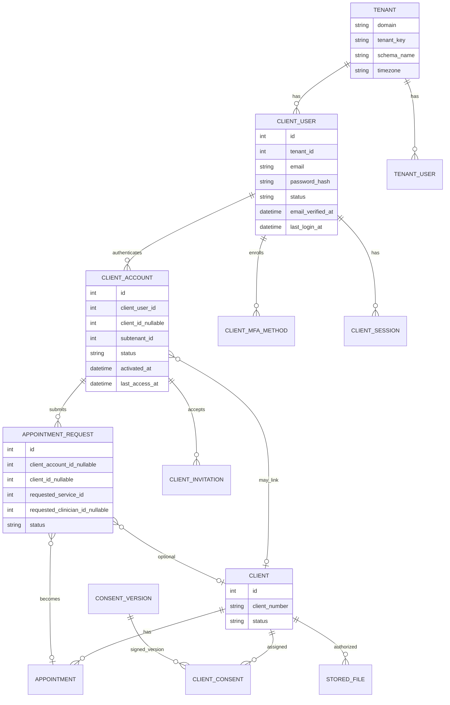
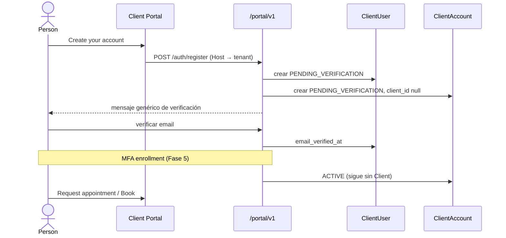
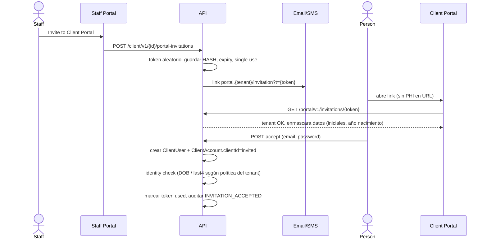
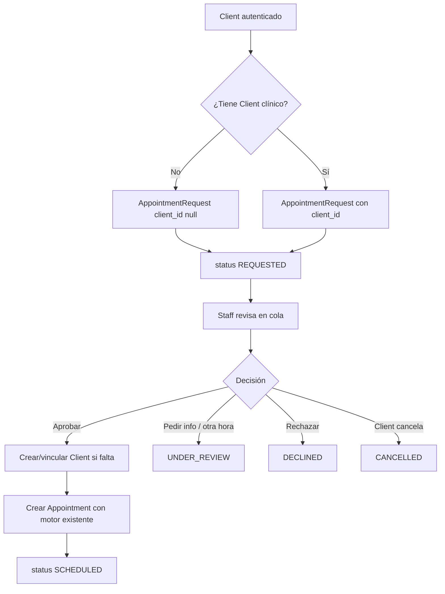
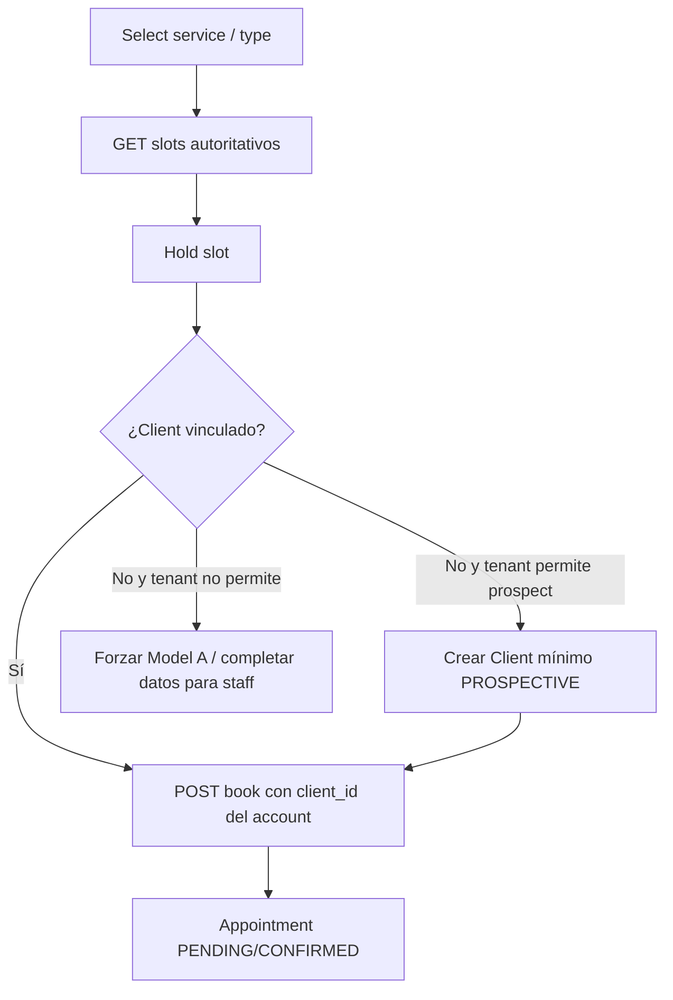

# FICE Medical — Propuesta de arquitectura: Client Portal

**Estado:** propuesta (sin implementación de producto)  
**Fecha:** 2026-08-16  
**Alcance:** análisis del código existente en `fice-medical-api`, `fice-medical` (Staff) y `fice-medical-admin`; diseño del Client Portal en `fice-medical-client`.  
**Terminología:** se usa **Client** (persona que recibe atención). No se usa Patient Portal / Patient Account / Patient User.

Este documento no afirma cumplimiento HIPAA. Describe controles técnicos que *soportan* requisitos de seguridad; el cumplimiento legal depende de salvaguardas administrativas, físicas, políticas, BAA, análisis de riesgo y operación.

---

## 1. Análisis de la arquitectura actual

### 1.1 Repositorios reales

| Repositorio | Rol actual |
|---|---|
| `fice-medical-api` | Backend único: Java / Spring Boot / Spring Security / Hibernate SCHEMA multi-tenancy / MySQL / JWT |
| `fice-medical` | Staff Portal: Vue 3.4 + Quasar 2.16 + Pinia 3 + Vue Router 4 + Axios + vue-i18n |
| `fice-medical-admin` | Admin de plataforma (tenants, planes, roles, catálogos de referencia) |
| `fice-medical-client` | Repo vacío (README + LICENSE). Destino del Client Portal frontend |

No existe `fice-ui` ni un paquete de design system compartido. No hay código de Client Portal, `ClientAccount`, MFA backend, ni entidades de consentimiento persistidas.

### 1.2 Modelo de tenancy real (no es un solo “tenant = subdomain”)

FICE ya tiene **dos niveles**:

```
Tenant (esquema global `fice_db`, tabla `tenants`)
  domain            → header de login X-Tenant-Key
  tenant_key        → claim JWT `tenant_key`
  schema_name       → esquema Hibernate del tenant
  timezone          → IANA (default UTC)
  locale / date_format
  |
  +-- TenantUser (tabla `tenant_users`)  ← SOLO staff hoy
  |
  +-- schema del tenant
        +-- Subtenant (tabla `sub_tenants`, code = X-Subtenant-Key)
        +-- Client, Appointment, StoredFile, ClinicalAuditLog, ...
```

Ejemplo de mapeo con el dominio pedido:

| Host | Qué identifica hoy | Qué debería identificar el Client Portal |
|---|---|---|
| `first.clinica.com` | Staff. El primer label se trata como `Tenant.domain` | sin cambio |
| `portal.first.clinica.com` | **No soportado.** `tenant-from-host.js` exige exactamente un label antes del base domain | Client Portal del tenant `first` |
| `second.clinica.com` | Staff del tenant `second` | sin cambio |

`Subtenant` es la clínica/ubicación **dentro** del tenant. El Staff, tras el login, envía `X-Subtenant-Key` (código del subtenant). Un usuario staff sin subtenants asignados es rechazado.

**Implicación:** el requisito “el subdomain identifica el tenant” es correcto a nivel de **Tenant.domain**. El **subtenant** sigue siendo un eje de autorización interno. El Client Portal no debe ignorarlo.

### 1.3 Cómo se resuelve el tenant hoy

El backend **no** resuelve el tenant desde el `Host` en requests autenticados.

1. Login público: `POST /oauth/v1/login` + header `X-Tenant-Key` = `Tenant.domain` (`OauthService.getTenantByDomain`).
2. JWT: claims `sub` (username/email), `tenant_key`, `roles`, `token_type`.
3. `TenantFilter` extrae `tenant_key` del JWT, carga el Tenant, valida billing/módulo, exige usuario staff con acceso a subtenants, y exige `X-Subtenant-Key` (salvo rutas admin).
4. `TenantContext` (ThreadLocal) fija schema, timezone, locale, subtenant actual y `TenantUser`.
5. Hibernate: `CurrentTenantIdentifierResolverImpl` + `MultiTenantConnectionProviderImpl`.

Las URLs públicas (`SecurityConstants.PUBLIC_URLS`) **saltan** `TenantFilter`. El intake público resuelve tenant/subtenant desde headers que envía el frontend (`IntakeContextSupport`).

**Inconsistencia de `X-Tenant-Key` (no copiarla):**

| Flujo | Valor que espera el backend |
|---|---|
| `/oauth/v1/login`, forgot-password | `Tenant.domain` (`getTenantByDomain`) |
| `/intake/v1/**` | `Tenant.tenantKey` (`findByTenantKey`) |

El mismo header significa dos cosas distintas. El Client Portal no debe usar ese header como fuente de verdad: el tenant sale del Host.

En Staff, el resolver por host está **desactivado** y axios envía `X-Tenant-Key: 'pruebas'` (hardcoded). Eso es deuda operativa del EMR, no un patrón a replicar.

Esto **no** cumple el principio pedido: “Do not trust a tenantId sent by the frontend. The backend must independently resolve the tenant from the request/domain.”

### 1.4 Autenticación y seguridad actuales

| Pieza | Estado real |
|---|---|
| Login staff | `OauthController` `/oauth/v1/login` |
| Password | BCrypt (`SecurityConfig`) |
| JWT | HS256, access 15 min, refresh 1 h (`application.yml`) |
| Refresh | rotación: se revoca el refresh usado y se emite uno nuevo |
| Session store | tabla global `active_tokens` guarda el **JWT completo** |
| MFA | frontend Staff ya llama `/oauth/v1/mfa/*`; **backend no existe** |
| Rate limiting | enum `API_RATE_LIMIT_EXCEEDED`; **no hay implementación** |
| CORS | `allowedOrigins = *` |
| CSRF | ignorado solo en `PUBLIC_URLS`; el resto queda con CSRF default |
| Autorización | `@PreAuthorize("hasAuthority('...')")` sobre permisos de staff |
| Tokens en browser | `localStorage` (access + refresh) en Staff |
| Reset password | UUID en columna `tenant_users.reset_password_token` (no hashed) |

`JwtAuthenticationFilter` recarga `UserDetails` desde `tenant_users`. No hay `user_type` ni audience. Un token de staff y uno de Client serían indistinguibles si se reutiliza el mismo emisor sin claims nuevos.

### 1.5 Entidad Client (registro clínico)

`com.fice.medical.model.tenants.client.Client` — tabla `client` en el schema del tenant:

- Identidad clínica: `client_number`, `admission_date`, `status`, `notes`, `last_visit`
- Identificación cifrada: `id_number_encrypted`, `id_number_last4`
- `consent` es un **LocalDate**, no un workflow de consentimientos
- Demografía en `PersonalInformation` (nombre, sexo, raza, etnia, DOB, preferencia de comunicación, foto)
- Contactos, emails, teléfonos, direcciones
- Relaciones clínicas: alergias, historia, vitals, labs, insurance, referrals, care plans, screenings, follow-ups, clinicians, subtenants

**No hay credenciales en Client.** Eso se debe preservar.

`ClientAccessSupport` ya aísla por **subtenant**: un Client solo es visible si pertenece al `X-Subtenant-Key` actual. Eso es staff-scoped, no Client-ownership.

### 1.6 Citas (Appointment) — ya robustas para Model B staff/intake

Existe un motor completo y reutilizable:

- `Appointment`, `AppointmentSlot` (optimistic lock `@Version` + `findByIdForUpdate`)
- `AppointmentBookingService` con reintentos ante lock pesimista e idempotency key
- Hold de slot (`locked_until_utc`, `locked_by_session`)
- Policy por subtenant: cancel/reschedule windows
- Horarios, unavailability, tipos, reminders, notification outbox
- Estados: `PENDING`, `CONFIRMED`, `CHECKED_IN`, `COMPLETED`, `CANCELLED`, `NO_SHOW`, `RESCHEDULED`
- Tiempos en UTC (`start_at_utc` / `end_at_utc`); timezone del tenant en `TenantContext`

**Restricción crítica:** `appointment.client_id` es `nullable = false`. No se puede crear una Appointment sin Client.

Intake público ya implementa **Model B no autenticado**:

```
POST /intake/v1/client/intake     → crea un Client clínico completo
GET  /intake/v1/appointment-types
GET  /intake/v1/appointment-slots
POST /intake/v1/appointment-slots/{id}/hold
POST /intake/v1/appointments/book → exige `client_number`
```

Los consentimientos enviados en intake **no se persisten** (comentario explícito en `IntakeRegisterClientRequest`).

Esto choca con el requisito: “Do not automatically create a complete Client record simply because someone creates a Client Portal account / requests an appointment.”

### 1.7 Consentimientos

- Backend: no hay entidades `ConsentTemplate` / `ConsentVersion` / `ClientConsent`. Solo `Client.consent` (fecha) y categoría de storage `CONSENT_FORM`.
- Staff frontend: modelo completo ya diseñado (`/consents/v1/templates`, `/client/v1/{id}/consents`, firma pública `/consents/v1/public/sign`, página `/consent-sign`).
- Permisos Staff ya nombrados: `CONSENT_VIEW`, `CONSENT_SIGN`, `CONSENT_ASSIGN`, etc.

El Client Portal **no debe inventar otro modelo de consentimientos**. Debe consumir el que el Staff ya espera, que hay que implementar en API.

### 1.8 Documentos

`StoredFile` + `FileStorageController` `/files/v1`:

- Autenticado, categoría, `client_id`, checksum SHA-256, soft delete
- Download autenticado o con URL presigned (`expires` + `token`)
- `@PreAuthorize` con permisos staff (`VIEW_FILES`, `UPLOAD_FILES`)

No hay autorización “este archivo pertenece a *este* Client autenticado”. Exponer `/files/v1` al Client Portal sería IDOR.

### 1.9 Formularios, mensajes, billing, MFA, invitaciones

| Capacidad pedida | ¿Existe? |
|---|---|
| Forms para que el Client los llene | No. `Screening` es evaluación clínica staff |
| Mensajería segura clínica | No. STOMP se usa en telehealth |
| Billing Client (saldos, pagos) | No. Superbill es staff |
| MFA TOTP | Solo UI Staff; sin backend |
| Invitación a portal | No |
| ClientAccount | No |
| AppointmentRequest | No |
| Guardian / representante | No (sí hay `Contact` / relationship catalogs) |
| Rate limiting | No |
| Host-based tenant resolution | No en backend |

### 1.10 Auditoría

- `clinical_audit_log` (tenant schema): entity/action, before/after JSON, `changed_by` (id de TenantUser), `correlation_id`, IP, `client_id`, `subtenant_id`
- `tenant_audit_log` (global)
- `ApiRequestLoggingFilter` con correlation id
- Acciones actuales: CREATED/UPDATED/DELETED/VIEWED/MERGED/CANCELLED/RESCHEDULED/STATUS_CHANGED/file ops

No hay acciones `CLIENT_LOGIN`, `CONSENT_SIGNED`, `INVITATION_ACCEPTED`, etc. `changed_by` asume un `TenantUser` staff.

### 1.11 Frontend Staff — qué reutilizar y qué no

Reutilizable **como patrón**, no como dependencia:

- Quasar 2 + Vue 3 + Pinia + i18n + axios interceptors (refresh, tenant headers)
- `tenant-from-host.js` (hay que extenderlo para el prefijo `portal.`)
- Componentes atómicos pequeños si se extraen después (`TextInput`, `SignatureCanvas`, loading)
- Contratos ya diseñados de consent/MFA (paths y DTOs esperados)
- Enum de firma `CLIENT_PORTAL` ya existe en Staff (`consentSignatureMethodValues.clientPortal`)
- Páginas públicas Staff que **no** son el portal: `/consent-sign`, `/meet` (telehealth guest)

**No importar:** `MainLayout`, módulos clínicos, calendar staff, client chart, encounters, administration.

Staff también llama `/documents/v1/types` y `/documents/v1/generate` (generación de documentos clínicos). Eso no es el módulo de “Documents” del Client Portal: el portal lee `StoredFile` autorizados vía `/portal/v1/documents`, no el generador staff.

Staff guarda JWT en `localStorage`. El Client Portal no debe copiar esa decisión.

### 1.12 Hallazgo de higiene (preexistente)

`TenantContext.clear()` no hace `currentUser.remove()`. No bloquea el Client Portal, pero debe corregirse antes de meter un segundo tipo de principal en el mismo ThreadLocal.

---

## 2. Arquitectura propuesta del Client Portal

```text
                         FICE
                          |
          +---------------+----------------+
          |                                |
   Staff Portal                      Client Portal
   fice-medical                      fice-medical-client
   {tenant}.clinica.com              portal.{tenant}.clinica.com
          |                                |
          |         Spring Boot API        |
          |         fice-medical-api       |
          +---------------+----------------+
                          |
              TenantResolver (Host + JWT)
                          |
         +----------------+----------------+
         |                                 |
   StaffSecurityChain              ClientSecurityChain
   /oauth/**, /appointments/**     /portal/v1/**
   TenantUser + permissions        ClientUser + ClientAccount
         |                                 |
         +----------------+----------------+
                          |
                 TenantContext + Hibernate schema
                          |
                        MySQL
```

Principio: **producto separado, backend compartido, autorización distinta.**

El Client Portal no es una sección del Staff. No reutiliza endpoints staff. Reutiliza servicios de dominio donde ya son autoritativos (slots, booking, files storage, email/SMS, timezone).

---

## 3. Modelo de dominio

Separación estricta:

| Concepto | Qué es | Qué no es |
|---|---|---|
| **Client** | Registro clínico/demográfico en el tenant | Identidad de login |
| **ClientUser** | Identidad de autenticación (global, scoped a un tenant en Fase 1) | Chart clínico |
| **ClientAccount** | Acceso al portal: User ↔ (Client opcional) dentro de tenant+subtenant | Cita |
| **AppointmentRequest** | Solicitud previa a la cita | Appointment |
| **Appointment** | Cita confirmada en el motor existente | Request |
| **Invitation** | Token de un solo uso para vincular/activar | Credenciales |

Un `ClientAccount` **puede existir sin Client**. Eso cubre a una persona nueva que pide cita antes de ser registrada por la clínica.

Fase 6 (no implementar ahora): el mismo `ClientUser` podría tener varios `ClientAccount` en distintos tenants. Fase 1 crea la identidad **por tenant** para no construir el portal global.

---

## 4. Relaciones entre entidades



`TENANT_USER` (staff) y `CLIENT_USER` no se mezclan. No hay FK entre ellos.

---

## 5. Arquitectura de autenticación

### 5.1 Cadenas de seguridad separadas

Nueva `SecurityFilterChain` con order más alto para `/portal/v1/**`:

- Autenticación contra `ClientUserDetailsService` (no `UserDetailsServiceImp`)
- Authority fija `ROLE_CLIENT` (sin permisos staff)
- Rechazo si el JWT tiene `user_type != CLIENT` o `token_type != access`
- Staff JWT usado contra `/portal/**` → 401 genérico
- Client JWT usado contra `/appointments/v1`, `/client/v1`, `/files/v1` → 401 genérico

Login staff permanece en `/oauth/v1/login`. **No** se reutiliza para Clients.

### 5.2 Claims JWT mínimos (Client)

```
sub            = client_user_id (opaco, no email)
tenant_key     = Tenant.tenantKey
user_type      = CLIENT
account_id     = client_account_id
token_type     = access | refresh
jti            = id de sesión
```

No incluir: nombre, DOB, client_number, SSN/last4, diagnósticos, `client_id` si se puede resolver por `account_id` en servidor. `client_id` puede ser null (cuenta sin Client vinculado).

### 5.3 Sesiones

No copiar `active_tokens` guardando el JWT crudo.

Propuesta `client_session` (schema global o tenant; recomendado **global** porque `ClientUser` es global):

- `id` (jti), `client_user_id`, `tenant_id`, `client_account_id`
- `refresh_token_hash` (SHA-256), never plaintext
- `expires_at`, `revoked_at`, `ip_hash`, `user_agent_hash`
- rotación de refresh en cada uso (igual que staff, pero hashed)

Access token: memoria del SPA (no `localStorage`).  
Refresh: cookie `HttpOnly; Secure; SameSite=Lax` scoped al host del portal, o refresh en memoria si CORS/cookie entre API y SPA no está listo en Fase 1. Si Fase 1 debe usar Bearer por paridad con Staff, **prohibido** persistir el access token; solo sessionStorage del refresh como peor caso documentado, con plan de cookies en Fase 5.

### 5.4 Password

Reutilizar `PasswordEncoder` BCrypt y el patrón de `PasswordHistory`, sobre tablas Client. Política: longitud mínima, complejidad, no reutilizar N hashes, lockout por intentos (nuevo).

---

## 6. Arquitectura MFA

El Staff frontend **ya espera** MFA. El backend no lo tiene. Hay dos opciones:

| Opción | Recomendación |
|---|---|
| A. Implementar MFA staff primero y extraer un servicio compartido | Mejor a medio plazo |
| B. Implementar MFA solo Client en Fase 5, con tablas propias | Más rápido para el portal |

**Recomendación:** servicio compartido `MfaService` (TOTP + recovery codes) parametrizado por `principal_type` (`STAFF` \| `CLIENT`). Tablas:

- `mfa_method` (principal_type, principal_id, type=TOTP, secret_encrypted, enabled_at)
- `mfa_recovery_code` (hash, used_at)

Secretos TOTP cifrados con el AES-GCM ya existente (`AesGcmEncryptionService`), no en plaintext.  
Fase 1: login sin MFA, con flag de tenant `client_mfa_required` apagado.  
Fase 5: enrollment, challenge, disable, reset, revoke sessions.  
Passkeys/WebAuthn: fuera de Fase 5 inicial; dejar `type` extensible.

Login con MFA:

```
password OK → si MFA enabled → devolver mfa_challenge_token (no JWT de sesión)
POST /portal/v1/auth/mfa/verify → JWT + session
```

No revelar si el email existe.

---

## 7. Resolución de tenant

### 7.1 Frontend (contexto de UI, no frontera de seguridad)

Extender el resolver de host:

```
portal.first.clinica.com  → portal=true, tenantDomain=first
first.clinica.com         → portal=false, tenantDomain=first
```

`portal` debe añadirse a `reservedTenantSubdomains` del Staff para que Staff no interprete `portal` como tenant.

El frontend puede enviar `X-Tenant-Key` por compatibilidad. El backend **no lo usa como fuente de verdad** en el portal.

### 7.2 Backend (frontera de seguridad)

Nuevo `ClientPortalTenantFilter` (antes de autenticación):

```
Host
  → extraer tenantDomain (label después de "portal.")
  → Tenant por domain, status ACTIVE, billing OK
  → TenantContext.schema + timezone
  → si hay JWT: tenant_key del token DEBE coincidir con Host
     mismatch → 401 genérico
```

Subtenant:

- Si el tenant tiene un único subtenant `main=true`, se fija automáticamente (el Client no elige).
- Si hay varios, `ClientAccount.subtenant_id` es la fuente; el Client no puede cambiarlo por header.
- Ignorar `X-Subtenant-Key` del Client Portal (evitar tenant/clinic switching).

Login: el tenant sale del Host, no del body.

### 7.3 Cambio obligatorio en Staff/API antes del portal

Hoy el login staff confía en `X-Tenant-Key`. No hace falta cambiar Staff en Fase 1, pero el **Client Portal no puede copiar ese modelo**. El filtro de portal es nuevo; `TenantFilter` staff se deja como está, con un deny de paths `/portal/**`.

---

## 8. Modelo de autorización

Toda request `/portal/v1/**` autenticada valida, en este orden:

1. JWT válido, no revocado, `user_type=CLIENT`
2. Tenant(Host) == Tenant(JWT)
3. `ClientUser` ACTIVE (u otro estado permitido para el endpoint)
4. `ClientAccount` del user en ese tenant+subtenant, estado que autorice la acción
5. Recurso pertenece a ese `ClientAccount` y/o `Client` vinculado
6. Si `client_id` del recurso ≠ `ClientAccount.clientId` → 404 (no 403) para no filtrar existencia

Políticas por módulo (ejemplos):

| Recurso | Regla |
|---|---|
| Profile | solo el Client vinculado; si no hay Client, perfil limitado al User/Account |
| Appointments | `appointment.client_id = account.clientId` o request.`client_account_id = account.id` |
| Documents | `stored_file.client_id = account.clientId` AND categoría permitida al portal AND flag de visibilidad Client |
| Consents | asignación al Client vinculado |
| Forms | assignment al account/client |
| Messages | participantes incluyen el account |
| Staff notes / audit / other clients | nunca |

No reutilizar `@PreAuthorize("hasAuthority('VIEW_FILES')")`. Crear anotación o componente `ClientResourceAccess`.

---

## 9. Alta de un Client nuevo (sin registro clínico)



Estados de `ClientAccount`:

```
INVITED → PENDING_VERIFICATION → ACTIVE
ACTIVE → LOCKED | SUSPENDED | DISABLED
LOCKED → ACTIVE (unlock)
```

No borrar `ClientUser` si el Client clínico se archiva.

---

## 10. Invitación de un Client existente (Staff → Portal)



Reglas del token:

- 256 bits (`SecureRandom`), enviado en claro **una vez**
- persistir solo hash (SHA-256)
- expiry (p. ej. 72 h), single-use, revocable por staff
- no incluir nombre, DOB, MRN, email del Client en la URL
- el Client **no** elige un `clientId`; el token lo resuelve el servidor

Staff necesita un botón en el perfil del Client. Eso es cambio en `fice-medical` (Staff), no en el Client Portal: endpoint nuevo de invitaciones bajo `/client/v1/{id}/...` con permiso staff nuevo `CLIENT_PORTAL_INVITE`.

---

## 11. Flujo Appointment Request (Model A)

Configurable por subtenant: `portal_booking_mode = REQUEST | DIRECT | BOTH`.



Estados: `REQUESTED`, `UNDER_REVIEW`, `APPROVED`, `DECLINED`, `CANCELLED`, `SCHEDULED`.

El Client no elige slots reales en Model A (o los elige como *preferencia*, no como reserva). El servidor ignora clinician IDs que no sean bookable en ese subtenant.

---

## 12. Flujo Direct Online Booking (Model B)

Reutilizar `AppointmentBookingService`, `AppointmentSlotLockService`, idempotency y policy. **No** reimplementar disponibilidad en el frontend.



**Decisión de integridad (obligatoria, hay que elegir antes de Fase 2):**

Hoy `appointment.client_id` NOT NULL y el intake crea un Client clínico completo. Opciones:

| Opción | Pros | Contras |
|---|---|---|
| **B1 (recomendada Fase 2):** Client `status=PROSPECTIVE` mínimo (nombre, DOB, contacto). No chart clínico (sin allergies/labs/notes) | Encaja en FK actual; staff convierte a ACTIVE | Es un Client, aunque incompleto |
| **B2:** `appointment.client_id` nullable + `client_account_id` | Más fiel al dominio pedido | Cambia el núcleo de scheduling; más riesgo |
| **B3:** Model B solo si ya hay Client vinculado; nuevos van a Model A | Cero cambio de Appointment | Clínicas “self-schedule” no cubren walk-in digital |

Recomendación: **B1** para no romper el motor de citas; documentar que PROSPECTIVE ≠ chart completo (sin módulos clínicos hasta que staff promocione). No copiar `IntakeService.addNewClient` que persiste allergies/vitals/labs.

El intake público actual (`/intake/v1`) es un tercer canal. Hay que decidir si:

- se mantiene como kiosk/embed staff, o
- se depreca a favor del Client Portal.

No dejar tres caminos que creen Clients con reglas distintas sin política.

---

## 13. Flujo de consentimientos

Implementar primero el modelo que el Staff frontend ya define, luego exponer subconjunto al portal.

```
ConsentTemplate (tipo: TREATMENT, TELEHEALTH, ROI, PRIVACY, COMMUNICATION, FINANCIAL, OTHER)
  └── ConsentVersion (contenido inmutable, status DRAFT/PUBLISHED)
        └── ClientConsent (client_id, version_id, status, signature snapshot)
```

Firma en portal:

1. GET contenido de **esa** versión (no la latest si ya estaba asignada)
2. POST sign / decline
3. Snapshot inmutable: contenido, method=`CLIENT_PORTAL_DIGITAL`, signer, timestamp, IP hash, user agent hash, version id
4. Si la clínica publica v2: nueva asignación; la firma v1 permanece

Métodos (enum alineado al frontend Staff `consentSignatureMethodValues`): in-person digital, in-person paper, secure remote link, Client Portal digital.

La página pública Staff `/consent-sign` puede convivir (remote link). El portal es otro canal de firma sobre la misma entidad `ClientConsent`.

---

## 14. Flujo de acceso a documentos

```
Client → GET /portal/v1/documents/{id}/content
      → auth CLIENT
      → tenant Host == JWT
      → account.clientId == file.client_id
      → categoría en allowlist del portal (p.ej. CLINICAL_DOCUMENT, CONSENT_FORM, INSURANCE_DOCUMENT)
      → flag client_visible (nuevo en stored_file o tabla de ACL)
      → stream (no URL pública permanente)
```

No usar `/files/v1/{id}/download` staff.  
No presigned público sin expiración corta + token atado a session.  
Auditar `DOCUMENT_VIEWED` / `DOCUMENT_DOWNLOADED` sin filename clínico innecesario.

---

## 15. Diseño de API

Seguir el patrón existente `{area}/v1/...`, no `/api/client/...`.

Prefijo: **`/portal/v1`**

### Auth

| Método | Path | Auth |
|---|---|---|
| POST | `/portal/v1/auth/register` | Host tenant |
| POST | `/portal/v1/auth/verify-email` | token |
| POST | `/portal/v1/auth/login` | Host tenant |
| POST | `/portal/v1/auth/mfa/verify` | challenge (Fase 5) |
| POST | `/portal/v1/auth/refresh` | refresh |
| POST | `/portal/v1/auth/logout` | Client JWT |
| POST | `/portal/v1/auth/password-reset/request` | Host tenant |
| POST | `/portal/v1/auth/password-reset/confirm` | token |
| GET | `/portal/v1/invitations/{token}` | Host tenant |
| POST | `/portal/v1/invitations/{token}/accept` | Host tenant |

### Portal autenticado

| Método | Path |
|---|---|
| GET | `/portal/v1/me` |
| GET/PATCH | `/portal/v1/profile` |
| GET | `/portal/v1/dashboard` |
| GET | `/portal/v1/appointments` |
| GET | `/portal/v1/appointments/{id}` |
| POST | `/portal/v1/appointments/requests` |
| POST | `/portal/v1/appointments/book` |
| POST | `/portal/v1/appointments/{id}/cancel` |
| POST | `/portal/v1/appointments/{id}/reschedule` |
| GET | `/portal/v1/appointment-types` |
| GET | `/portal/v1/appointment-slots` |
| POST | `/portal/v1/appointment-slots/{id}/hold` |
| GET | `/portal/v1/documents` |
| GET | `/portal/v1/documents/{id}` |
| GET | `/portal/v1/documents/{id}/content` |
| GET | `/portal/v1/consents` |
| GET | `/portal/v1/consents/{id}` |
| POST | `/portal/v1/consents/{id}/sign` |
| POST | `/portal/v1/consents/{id}/decline` |
| GET | `/portal/v1/forms` |
| POST | `/portal/v1/forms/{id}/draft` |
| POST | `/portal/v1/forms/{id}/submit` |
| GET/POST | `/portal/v1/messages` |
| GET | `/portal/v1/security/sessions` |
| DELETE | `/portal/v1/security/sessions/{id}` |
| DELETE | `/portal/v1/security/sessions` |

### Staff (mínimo para habilitar el portal)

| Método | Path |
|---|---|
| POST | `/client/v1/{clientId}/portal-invitations` |
| DELETE | `/client/v1/{clientId}/portal-invitations/{id}` |
| GET | `/appointments/v1/requests` (cola Model A) |
| POST | `/appointments/v1/requests/{id}/approve` |
| POST | `/appointments/v1/requests/{id}/decline` |
| PATCH | `subtenant_setting` `portal_booking_mode`, `portal_enabled` |

Errores: mensajes genéricos. Sin schema names, sin stack traces, sin “ese email pertenece a Juan Pérez”.

---

## 16. Estructura del frontend (`fice-medical-client`)

Vue 3 + Quasar 2 + Pinia + Vue Router + vue-i18n, **mismo stack mayor** que Staff para consistencia operativa, **proyecto nuevo**.

```
fice-medical-client/
  src/
    boot/          axios, i18n, auth
    layouts/       GuestLayout, PortalLayout (simple)
    pages/
      auth/        login, register, invitation, reset-password
      dashboard/
      appointments/
      documents/
      consents/
      forms/
      messages/
      profile/
      security/
    stores/        auth, tenant, dashboard
    utils/         host-tenant, session
    router/
```

UX: más simple que Staff. Navegación corta, targets táctiles grandes, estados claros, mínimo PHI en pantalla. Code splitting por ruta. No cargar chart clínico.

No crear `fice-ui` en Fase 1 (coste de extracción > beneficio). Si más adelante hay 3+ apps, extraer tokens de color/tipografía.

---

## 17. Routing del Client Portal

```
/login
/register
/invitation
/reset-password
/verify-email

/dashboard          (auth)
/appointments
/appointments/request
/appointments/book
/appointments/:id
/documents
/documents/:id
/consents
/consents/:id
/forms
/forms/:id
/messages
/profile
/security
```

Guard: sesión Client válida. Rutas guest redirigen a dashboard si hay sesión. IDs numéricos en path están bien; no poner nombres ni MRN en query.

---

## 18. Controles de seguridad

Implementar / no copiar del Staff:

| Control | Client Portal |
|---|---|
| Tenant isolation | Host + JWT + schema; mismatch deny |
| Object-level auth | siempre por account/client; 404 |
| Password hashing | BCrypt |
| Invitation/reset tokens | random + hashed at rest + expiry + single-use |
| MFA | Fase 5 TOTP |
| Rate limit | login, register, reset, MFA, invitation, book, request, messages |
| Lockout | intentos de login por email+tenant+IP |
| CORS | allowlist `https://portal.{tenant}.{base}` y localhost de desarrollo; nunca `*` |
| Security headers | CSP, HSTS, X-Content-Type-Options, Referrer-Policy |
| Cookies | Secure / HttpOnly / SameSite cuando se usen |
| PHI | no en URL, logs, JWT, analytics, errores |
| HTTPS | obligatorio en no-dev |
| Concurrent booking | reutilizar locks del motor de citas |
| Privilege escalation | cadenas de seguridad disjuntas |

Rate limiting: el código ya tiene `FiceError.API_RATE_LIMIT_EXCEEDED`. Implementar filtro (Bucket4j o equivalente) **antes** del portal; también debería aplicarse a `/oauth/v1/login` e `/intake/v1/**` (el intake público es abusable hoy).

---

## 19. Requisitos de auditoría

Extender `AuditAction` / `AuditEntityType` o tabla `portal_audit_log` (preferible **separada** para no mezclar PHI clínico staff con eventos de cuenta):

Eventos: `CLIENT_LOGIN`, `CLIENT_LOGIN_FAILED`, `ACCOUNT_CREATED`, `ACCOUNT_ACTIVATED`, `INVITATION_CREATED`, `INVITATION_ACCEPTED`, `PASSWORD_CHANGED`, `PASSWORD_RESET`, `MFA_*`, `APPOINTMENT_REQUESTED`, `APPOINTMENT_BOOKED`, `APPOINTMENT_CANCELLED`, `APPOINTMENT_RESCHEDULED`, `CONSENT_VIEWED`, `CONSENT_SIGNED`, `CONSENT_DECLINED`, `DOCUMENT_VIEWED`, `DOCUMENT_DOWNLOADED`, `FORM_SUBMITTED`, `MESSAGE_SENT`, `SESSION_REVOKED`.

Campos: `client_user_id`, `client_account_id`, `tenant_id`, `subtenant_id`, `action`, `entity_type`, `entity_id`, `timestamp` UTC, `correlation_id`, `ip_hash`, metadata no-PHI.

`changed_by` de `clinical_audit_log` hoy es un `TenantUser` id. No escribir IDs de ClientUser ahí sin discriminador. Para acciones clínicas originadas en el portal (p.ej. consent signed), o bien:

- `changed_by` nullable + `changed_by_type`, o
- solo `portal_audit_log` + el workflow de consent ya tiene su propia evidencia de firma.

---

## 20. Cambios de base de datos (mínimos)

### Schema global `fice_db` (`db/migration`)

- `client_users`
- `client_sessions`
- `client_mfa_methods` / `client_mfa_recovery_codes` (Fase 5; se pueden crear vacíos o diferir)
- `portal_audit_log` (si se pone global) **o** en tenant

### Schema tenant (`db/tenants`)

- `client_account`
- `client_invitation`
- `appointment_request`
- `client_consent` + `consent_template` + `consent_version` (Fase 3; también usados por Staff)
- `portal_form_assignment` / `portal_form_submission` (Fase 3)
- `portal_message_thread` / `portal_message` (Fase 4)
- `stored_file.client_visible` (boolean, default false)
- `subtenant_setting`: `portal_enabled`, `portal_booking_mode`, `portal_mfa_required`, `portal_allow_self_register`

Índices únicos: `(tenant_id, email)` en `client_users`; `(client_user_id, subtenant_id)` en `client_account`; hash único de invitation token.

No modificar `tenant_users` para meter Clients.

---

## 21. Consideraciones de migración

- Flyway global (`db/migration`) está activo. Flyway tenant (`classpath:db/tenants`) **solo tiene** `V2508100101__InitialTenantMigration.sql`. Muchas entidades JPA clínicas (`stored_file`, `clinical_audit_log`, `screening*`, `vitals`, `labs`, `subtenant_setting`, etc.) **no están** en ese script: hay drift entre código y migraciones tenant.
- Las tablas del Client Portal **deben** ir en un `V26....sql` nuevo bajo `db/tenants` (y global para `client_users`). No asumir que Hibernate `ddl-auto: validate` creó ya un historial Flyway coherente: hay que verificar schemas reales antes de migrar.
- Tenants existentes reciben las tablas nuevas vacías. Sin backfill de cuentas (nadie tiene portal todavía).
- `stored_file.client_visible = false` por defecto: nada se filtra al portal hasta que staff marque o una regla de categoría lo permita.
- Intake existente no se borra en el mismo release. Flag por subtenant.
- Staff frontend: añadir `portal` a `reservedTenantSubdomains` para no romper resolución de host el día que exista `portal.first.*` en el mismo DNS.
- CORS staff y portal: dejar de usar `*` antes de exponer el portal a Internet.
- Consent/MFA: el Staff UI ya apunta a APIs inexistentes; implementar esas APIs **en el mismo programa** que el portal para no tener dos modelos.

Compatibilidad: `@EnableMethodSecurity` y `TenantFilter` deben **excluir** `/portal/v1/**` para que un Client no entre al pipeline que exige `TenantUser` + subtenants de staff (hoy eso devolvería “User not enabled for tenant” o “no subtenant access”).

---

## 22. Riesgos

| Riesgo | Severidad | Mitigación |
|---|---|---|
| Reutilizar `TenantUser` / `/oauth/v1/login` | Crítica | Tablas y filter chain separadas |
| JWT staff aceptado en `/portal` o viceversa | Crítica | claim `user_type` + audience + chains |
| Confiar en `X-Tenant-Key` / `X-Subtenant-Key` del browser | Crítica | resolver Host; account fija el subtenant |
| Intake público crea Client completo y es abusable (sin rate limit) | Alta | rate limit; no reusar intake para portal; PROSPECTIVE mínimo |
| `appointment.client_id` NOT NULL vs request sin Client | Alta | decisión B1/B2/B3 antes de Fase 2 |
| Staff UI de consent/MFA sin backend | Alta | implementar API de consent/MFA como dependencia de Fase 3/5 |
| IDOR en `/files/v1` si se reusa | Crítica | endpoints portal + `client_visible` |
| Tokens en localStorage (XSS → sesión) | Alta | no copiar; memoria + cookie refresh |
| `active_tokens` almacena JWT en claro | Media | sesiones hashed para Client; plan de endurecer staff |
| CORS `*` | Alta | allowlist por host de portal |
| `TenantContext.clear()` no limpia user | Media | fix inmediato |
| PHI en logs de intake (`log.error` con mensajes) | Media | masker ya existe; aplicarlo al portal |
| Doble booking | Media | reutilizar locks existentes, no un calendario SPA |
| Mezclar Screening clínico con forms del portal | Media | entidades nuevas |
| Portal global multi-clínica prematuro | Media | no implementar Fase 6 ahora; User por tenant |
| Afirmar HIPAA compliance por estos controles | Alta | no hacerlo |
| `X-Tenant-Key` = domain en login y = tenant_key en intake | Alta | no reutilizar el header; Host en portal |
| Flyway tenant incompleto vs entidades JPA | Alta | inventario de schemas reales antes de V26 portal |
| Staff axios con tenant hardcoded `pruebas` | Media | no copiar; portal resuelve Host; Staff es deuda aparte |

---

## 23. Orden de implementación recomendado

### Principio

No implementar todo. Cada fase debe poder desplegarse sin las siguientes. **No escribir el SPA completo vacío:** cada fase entrega backend + frontend usable.

### Cambios que DEBEN hacerse antes de Fase 1 (hardening / prerrequisitos)

Estos tocan `fice-medical-api` (y un detalle de Staff) y son necesarios para implementar el portal **con seguridad**:

1. Excluir `/portal/v1/**` de `TenantFilter` staff y de `UserDetailsServiceImp`.
2. Corregir `TenantContext.clear()` para limpiar `currentUser`.
3. CORS allowlist (al menos configurable; dejar de hardcodear `*`).
4. Rate limiting en login staff, forgot-password e `/intake/v1/**`.
5. Añadir `portal` a `reservedTenantSubdomains` en Staff.
6. Decisión documentada B1/B2/B3 para citas sin Client.
7. Política sobre el futuro del intake público vs portal.

---

### Fase 1 — Fundación: proyecto, tenancy, auth, invitación, dashboard

**Objetivo:** un Client invitado puede entrar a `portal.{tenant}/` y ver un dashboard mínimo.

| Capa | Trabajo |
|---|---|
| DB | `client_users`, `client_sessions`, `client_account`, `client_invitation`, `portal_audit_log`; settings `portal_enabled` |
| Backend | `ClientPortalTenantFilter`, security chain, register/login/refresh/logout, verify-email, invitation accept, `GET /me`, `GET /dashboard` (citas próximas si hay Client; si no, CTAs) |
| Staff | `POST /client/v1/{id}/portal-invitations` + UI “Invite to Client Portal” |
| Frontend | scaffold Quasar en `fice-medical-client`; login, register, invitation, dashboard, profile básico |
| Seguridad | Host resolver, user_type JWT, rate limit portal auth, tokens no-PHI, auditoría login |
| Tests | auth isolation (staff token ≠ portal), tenant mismatch, invitation replay, IDOR me/profile |
| Migración | Flyway global + tenant; sin backfill |

Fuera de Fase 1: MFA, booking, consents, messages, guardian.

---

### Fase 2 — Citas

| Capa | Trabajo |
|---|---|
| DB | `appointment_request`; setting `portal_booking_mode`; posible status `PROSPECTIVE` en Client **o** nullable `client_id` |
| Backend | requests CRUD portal + cola staff; book/cancel/reschedule reutilizando `AppointmentBookingService` / policy / slots; never trust slot times del client |
| Frontend | listado upcoming/past, request, book, detail, cancel/reschedule |
| Seguridad | no elegir clinician no bookable; no ver citas de otro Client; locks concurrentes |
| Tests | double-book, idempotency, request sin Client, book con account de otro tenant |
| Migración | según B1/B2/B3 |

---

### Fase 3 — Consents, forms, documents

| Capa | Trabajo |
|---|---|
| DB | templates/versions/client_consent (compartido con Staff); forms portal; `client_visible` en files |
| Backend | implementar `/consents/v1` que el Staff ya llama; `/portal/v1/consents`; `/portal/v1/documents`; forms assign/submit |
| Staff | dejar de estar “adelantado al API” en consents |
| Frontend | consents review/sign/decline; documents list/preview/download; forms draft/submit |
| Seguridad | snapshot inmutable; stream de files; no categorías clínicas internas |
| Tests | firmar versión vieja, token remote link, download IDOR |

---

### Fase 4 — Mensajería y notificaciones

| Capa | Trabajo |
|---|---|
| DB | threads/messages; reutilizar `appointment_notification_outbox` / `EmailService` / SMS |
| Backend | `/portal/v1/messages`; notificaciones sin PHI (plantillas tipo “tiene un mensaje nuevo”) |
| Frontend | inbox simple |
| Seguridad | attachments con el mismo pipeline de files; rate limit |
| Tests | no leak entre accounts |

---

### Fase 5 — MFA, sesiones, passkeys (passkeys opcional al final)

| Capa | Trabajo |
|---|---|
| DB | mfa methods, recovery codes |
| Backend | TOTP enroll/verify/disable/reset; list/revoke sessions; logout all |
| Frontend | security page |
| Seguridad | secrets cifrados; challenge tokens de un solo uso; revoke al disable MFA |
| Tests | MFA bypass, recovery reuse, session revoke |

Compartir `MfaService` con Staff si se implementa el backend MFA staff en paralelo (el UI staff ya está).

---

### Fase 6 — Guardian / multi-clínica (fuera de alcance actual)

Diseñar `ClientAccount` con `relationship_type=SELF` ahora para no pintar un 1:1 rígido. No implementar representantes ni `portal.fice.com` selector de clínicas.

---

## Apéndice A — Qué existe y se reutiliza vs qué se crea

**Reutilizar**

- `Tenant`, `Subtenant`, `TenantContext`, Hibernate schema multi-tenancy, timezone IANA
- `Client`, `PersonalInformation`, contactos
- `AppointmentBookingService`, slots, holds, policy, idempotency
- `StoredFile` + storage providers (no el controller staff)
- `EmailService`, SMS, `AesGcmEncryptionService`, `SensitiveDataMasker`, correlation id
- `PasswordEncoder`, patrón refresh rotation
- `subtenant_setting` para flags de portal
- Contratos frontend Staff de consent/MFA (como especificación)

**No reutilizar tal cual**

- `TenantUser`, `/oauth/v1/*`, `TenantFilter`, permisos `@PreAuthorize` staff
- `/intake/v1` como onboarding del portal
- `/files/v1`, `/client/v1/{id}` staff, `/appointments/v1` staff
- `MainLayout` y módulos clínicos del SPA Staff
- `localStorage` para JWT
- `Client.consent` (LocalDate) como workflow de consentimientos

**Crear**

- Frontend `fice-medical-client`
- `ClientUser`, `ClientAccount`, `ClientInvitation`, `AppointmentRequest`
- `/portal/v1/**` + security chain
- Host-based tenant resolver para portal
- Motor de consentimientos (también para Staff)
- Forms/messages portal
- MFA persistente
- Rate limiting real

---

## Apéndice B — Mapeo de terminología requisito vs código FICE

| En el requisito | En FICE actual | En el Client Portal |
|---|---|---|
| tenant / clinic subdomain | `Tenant.domain` + opcionalmente `Subtenant.code` | Host `portal.{Tenant.domain}`; subtenant = account |
| User | `TenantUser` (staff only) | `ClientUser` nuevo |
| Client | `Client` | el mismo |
| ClientAccount | no existe | nuevo |
| JWT tenant | claim `tenant_key` | igual + `user_type` |
| Staff login header | `X-Tenant-Key` = domain | Portal: Host; no confiar en header |

---

## Apéndice C — Criterio para empezar a escribir código

Se puede iniciar Fase 1 cuando estén aceptados:

1. Cadenas de seguridad y tablas de usuario **separadas** de staff.
2. Resolución de tenant por Host en el portal.
3. Invitación por token hashed; account sin Client permitido.
4. Decisiones B1/B2/B3 e intake vs portal.
5. CORS allowlist y rate limit como prerrequisito de exposición.

Hasta entonces, este documento es el entregable. No hay código de producto en `fice-medical-client` todavía.
